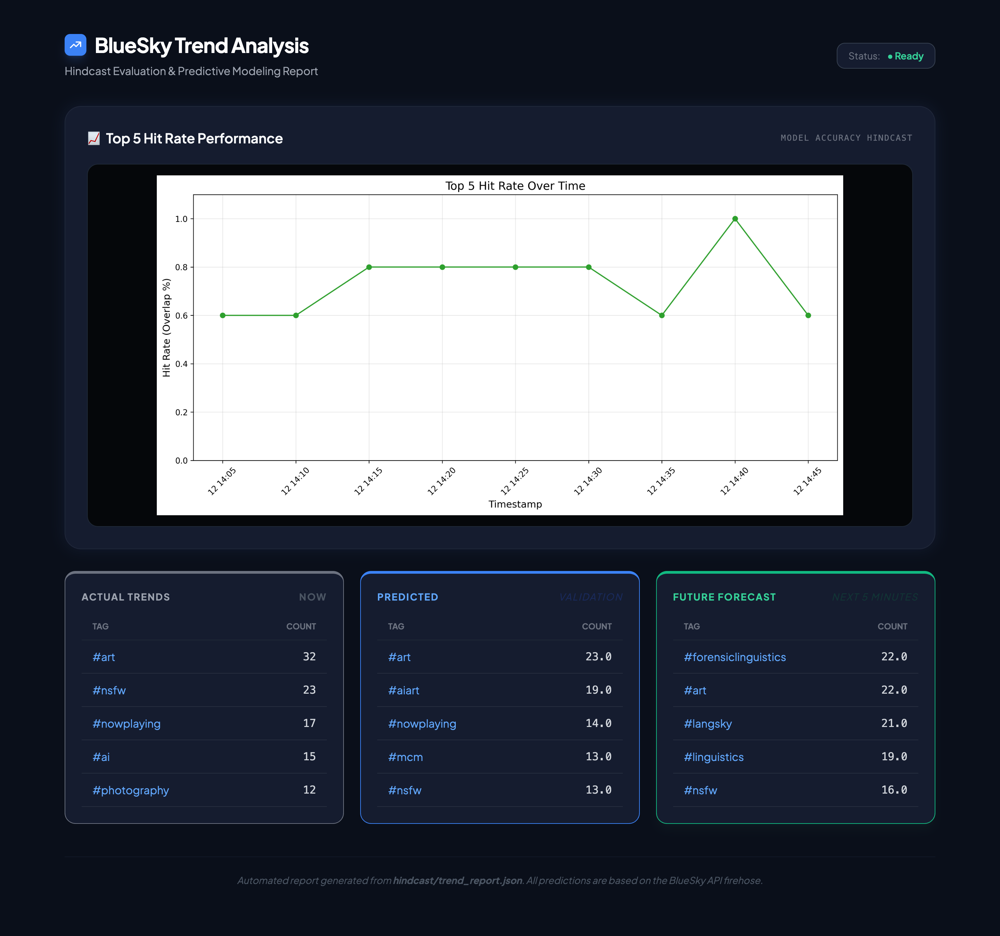

# ID2223 Course Project – Real-Time Bluesky Trend Prediction



## 1. Project Overview
This project builds a fully automated, end-to-end machine learning system that predicts future trending hashtags on Bluesky in real time.
Unlike Kaggle-style static datasets, Bluesky does not provide historical trend data. Therefore, we design and implement our own continuous data collection, feature engineering, model training, and prediction infrastructure that operates on a live social media stream.

Every 5 minutes, the system:
* Scrapes live Bluesky posts,
* Aggregates them into hashtag-level trend features,
* Predicts the next time-window’s hashtag post counts,
* Ranks them to obtain the predicted Top-5 trends, and
* Publishes the results in a real-time monitoring dashboard.

This mirrors the architecture of production-grade ML systems used for:
* social-media trend detection,
* market demand forecasting,
* and streaming analytics platforms.

---

## 2. Prediction Task
We define the learning problem as:

Given hashtag statistics from the current 5-minute window, predict the number of posts each hashtag will receive in the next 5-minute window.

Formally:
$$X_t \rightarrow \hat{y}_{t+1}$$

Where:
* $X_t$ = aggregated features of all hashtags at time $t$,
* $y_{t+1}$ = number of posts for each hashtag in the next time window.

From the predicted counts, we rank hashtags and obtain the predicted Top-5 trending hashtags.

---

## 3. System Architecture
This project implements a serverless, streaming ML architecture:


```yaml
Bluesky Firehose
        |
        v
Scraper (JSONL)
        |
        v
Feature Pipeline (CSV / Feature Store)
        |
        v
Feature Store (Local or Hopsworks)
        |
        v
Batch Inference
        |
        v
Predicted Trends
        |
        v
Static Dashboard (HTML)
```

The system continuously loops every 5 minutes, forming a closed prediction–evaluation feedback loop.

---

## 4. Core Pipelines
The project contains five fully independent pipelines, matching modern MLOps practice.

### 4.1 Feature Backfill
`feature_backfill.py`
Since Bluesky provides no historical dataset, we reconstruct training data by:
* processing previously scraped JSONL files,
* aggregating them into 5-minute windows,
* computing hashtag-level features,
* and writing them into the feature store.
This enables offline training from streaming data.

### 4.2 Feature Pipeline (Online Ingestion)
`feature_pipeline.py`
Runs every 5 minutes and performs:
* Live scraping from Bluesky firehose,
* Parsing and hashtag extraction,
* Feature aggregation per hashtag,
* Writing new rows into the feature store.
This creates a continuously growing time-series dataset.

### 4.3 Training Pipeline
Trains a Ridge Regression model to predict future hashtag volumes.
**Why Ridge?**
* Dataset size is moderate (~30,000 hashtag-window samples),
* Features are correlated (post count, token volume, growth rate),
* Ridge provides stable, regularized regression.

The trained model is:
* serialized,
* and optionally uploaded to Hopsworks Model Registry.

### 4.4 Batch Inference Pipeline
For each new feature batch:
* Load the latest model,
* Predict future hashtag counts,
* Store predictions,
* Compute Top-5 predictions,
* Compare against actual observed Top-5 when available.
This produces quantitative evaluation data for the dashboard.

### 4.5 Real-Time Monitoring Dashboard
Every 5 minutes, the system generates a static HTML dashboard showing:
* Predicted Top-5 hashtags,
* Actual Top-5 hashtags,
* Hit-rate of predictions,
* Trend comparison plots.
This allows human-in-the-loop validation of model quality.

---

## 5. Data Source
Bluesky does not provide any historical trend API.
Therefore we use the live firehose via:
[https://github.com/deepfates/bsky-scraper](https://github.com/deepfates/bsky-scraper)

Our system continuously collects:
* post count,
* hashtag,
* post_length,
* timestamps

We then convert raw posts into hashtag-level time-series features.
This ensures the project satisfies ID2223’s requirement for:
* Dynamic data sources, not static datasets.

---

## 6. Execution Modes
The system supports two fully functional backends, selected via `.env`.

### 6.1 Local Mode (Recommended)
* **Feature store:** CSV files
* **Model storage:** local disk
* **Monitoring:** local HTML
This mode is fully self-contained and works without external services.
Due to Hopsworks service outage on Jan 12, all cloud pipelines were temporarily blocked. Therefore, for evaluation and demonstration, local mode is recommended.

### 6.2 Hopsworks Mode
* Feature Store
* Model Registry
* Batch inference tracking
This implements the cloud-native MLOps version of the system.

---

## 7. How to Run
One command starts the entire real-time ML system:
```bash
./run_pipelines.sh
```
This launches:

* live scraping,
* feature ingestion,
* inference,
* and dashboard generation,

in a continuous loop every 5 minutes.

---

## 8. Feature Engineering

The prediction model is trained on a compact but expressive set of **eight time-series and content-based features** computed for each hashtag at every 5-minute window. These features capture **volume, momentum, competition, content intensity, and temporal cycles**, which are the main drivers of short-term trend dynamics on social platforms.

Let \(h\) be a hashtag and \(t\) be the current 5-minute window.

| Feature | Description |
|--------|-------------|
| `post_count` | Total number of posts mentioning hashtag \(h\) during the current window \(t\). This represents the current popularity level. |
| `count_lag1` | Post count of the same hashtag in the previous time window \(t-1\). This provides short-term memory of past activity. |
| `delta_count` | \(post\_count_t - count\_lag1\). Measures acceleration or decay in attention. Strong positive values indicate a rapidly emerging trend. |
| `share_of_attention` | Fraction of all hashtagged posts in the current window that belong to hashtag \(h\). This normalizes popularity by overall platform activity. |
| `rank_in_snapshot` | Rank of hashtag \(h\) among all hashtags in the current window based on `post_count`. Encodes competitive position. |
| `tokens_per_post` | Average number of tokens per post for hashtag \(h\). Serves as a proxy for content richness and discussion intensity. |
| `hour_sin` | \(\sin(2\pi \cdot hour / 24)\). Encodes daily cyclic patterns in posting behavior in a continuous form. |
| `hour_cos` | \(\cos(2\pi \cdot hour / 24)\). Complements `hour_sin` to allow the model to learn time-of-day effects without discontinuities. |

Together, these features allow the Ridge regression model to infer:
- whether a hashtag is **already large** (`post_count`),
- whether it is **growing or fading** (`delta_count`, `count_lag1`),
- how **dominant** it is in the global conversation (`share_of_attention`, `rank_in_snapshot`),
- how **engaged** users are (`tokens_per_post`),
- and where the system is in the **daily activity cycle** (`hour_sin`, `hour_cos`).

This feature set provides a strong, low-dimensional baseline suitable for small-to-medium streaming datasets while remaining extensible for more complex models.


---

## 9. Future Work
The system is already a complete production-style ML pipeline.
Possible extensions include:
* online model retraining,
* automated model replacement (champion–challenger),
* anomaly detection,
* and multi-platform trend fusion.

## 10. Dashboard
A static HTML dashboard is regenerated every 5 minutes to visualize:

* predicted vs actual Top-5 trends,
* next Top-5 trends prediction,
* and prediction accuracy over time.